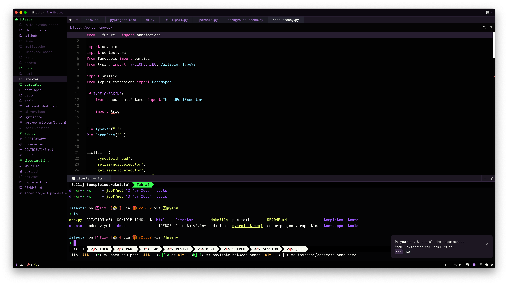
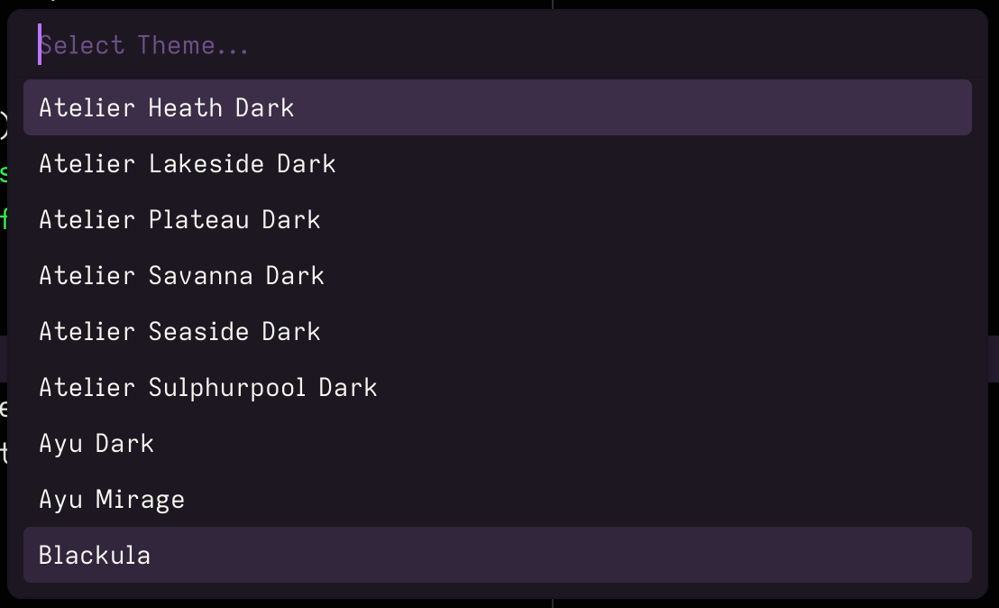

# blackula

> [!NOTE]
> A dark theme for Zed, with a hint of Dracula (or maybe the other way around?)

## Installation

You have a few options (in order of preference):

1. Install via Zed extensions:
   1. Open Zed.
   2. Press `Cmd/Ctrl+Shift+P` to open the command palette.
   3. Select `zed: extensions`
   4. Type `blackula` and click `Install`.
2. Open [`blackula.json`](./themes/blackula.json) and copy/paste that into your `~/.config/zed/themes/` directory as `blackula.json`
3. Clone this repository, move into your `~/.config/zed/themes/` directory.

## Usage

Once you have the theme installed, you can enable it by opening the theme
palette (`Cmd/Ctrl+K` -> `Cmd/Ctrl+T`) and selecting `blackula`.

## License

MIT

## Credits

I basically merged [The Dark Side](https://github.com/Imgkl/the-dark-side),
my own custom JetBrains theme, and [Dracula](https://github.com/dracula/zed).
